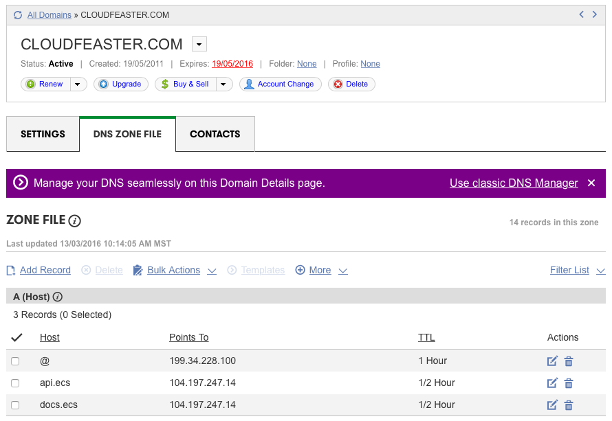

# Provisioning

These instructions describe how to ...

## Setup Google Compute Engine Project

* setup a project in the
[Google Developer Console](https://console.developers.google.com/project) - in
the instructions below the project will be called ```ecs```

* enable the ```compute engine API``` in
the [Google Developer Console](https://console.developers.google.com/project)

* ```gcloud config configurations create ecs```

* ```gcloud config configurations activate ecs```

* ```gcloud auth login```

* ```gcloud config set project ecs```

* ```gcloud config set compute/zone us-central1-a```

## Choose Domain Names

* choose 2 x domain names - (i) api & (ii) docs - ECS has been tested
assuming domain names will be of the form ```api.ecs.yourservice.yourdomain.com```
and ```docs.ecs.yourservice.yourdmain.com```
* for example, [Cloudfeaster](https://github.com/simonsdave/cloudfeaster)
uses ECS and deploys it to
the ```api.ecs.cloudfeaster.com``` and ```docs.ecs.cloudfeaster.com```
domains

## Create SSL/TLS Certificates

* create SSL/TLS certs for the 2 x previously choosen domain names

## Create Strong(er) DHE Parameter

* see [this](https://raymii.org/s/tutorials/Strong_SSL_Security_On_nginx.html#Forward_Secrecy_&_Diffie_Hellman_Ephemeral_Parameters)
for reference
* previously generated DHE parameters may be used when 
spinning up the deployment ie you don't always need to
generate the parameters
* the command below took about 3 minutes to run on Mac OS X
with a 2.5 GHz Intel Core i5

```bash
>cd /vagrant
>openssl dhparam -out dhparam.pem 4096
>cat dhparam.pem
-----BEGIN DH PARAMETERS-----
MIICCAKCAgEAkwqgBasqm+j+kD4DzB6xgTOUbpJHKpERP/roeQQG+PHV5sGSDc5T
9Ngy/pp2py9xFz4ZmbS9zSW9pLdUYvmUTSJyaGWgotzEuwKX8gQLR+GbcEC1MVwy
X9BSpKyxbUjSUWijVLEg0WMS8pui6rTnk0R/Z0GIbpNYdVdXHEm6pUwDuw6j6QhD
qqIyH72/DmR9PiNLWZJT8Vq6LecUw8EGXqQNpkl5zCukW594wwjsJqUtWtb8/sDs
sRqNX1Sw8BRrXkJHuQKKUCUhUTZH+bsOBxl71ntZdnWPtS/w7hSlKnTPk3M/N3P4
mM9vvSjk2F37vnaWMrs5rkkI7rhNB5FNMkPvGBk637IBV5UvZ0y1pRxZ4CjJj/m4
mbmf/3lkor4jXgpeXVbHPgwEGb3sHAlvFaiaW+XhDbUiblGxkyM0boy7SQX6GDlL
u5TWtnrXp553qtGFnxfvD4tDv5J8SFPmGDy+uVEA6qYemYnKJyUaL17ra/G8TCA6
wGSZYla/xC1nxN/gFJd9g+6IdUpx987OqM1WxzobEyi6MZ0HDjBSfgoHfXgiG2IB
enOCulU7Pzj3vU4Do/CDFrUr6ld4frCOrnCX1lSYkl1zZfC3s2SzX9oRbvdgzv5m
ZiqH+qwj8aOZLDmsngLLe8/8GO7YUYX/rapcw1PQpwrHixjltX83utMCAQI=
-----END DH PARAMETERS-----
```

## Create API Credentials

* if you've already got a previously generated set of credentials then
you can use them
* if you need to generate credentials

```bash
> ecsctl.sh creds 5
Putting hashed credentials in new file '/home/vagrant/ecs/.htpasswd'
ed662dd52ae74ffd8a39a9c83938cfc8:e81e499c9062e25fb49083038f080721
1133cea55a2348f5a3fcddbad0fc6d80:8a7c79fcbda71a6bcbcdb07d12ed0c52
5fe9f24b3a1c460fae70eb3cf422c6ef:11dba5a17fc12cf5ccb32777d6532b68
b87cb745f4db4e19a87706642950a405:d8839a6de7aa99879850b2a2271422fb
c808e5453a0c463ab316056f677d2249:8d12a5d97a3ca74f0260a0bb1b0facca
>
```

## Spin up a deployment

* the command below spins up a 3-node ECS cluster

```bash
>ecsctl.sh \
    -v dep create \
    docs.ecs.cloudfeaster.com \
    api.ecs.cloudfeaster.com \
    /vagrant/docs.ecs.cloudfeaster.com.ssl.bundle.crt \
    /vagrant/docs.ecs.cloudfeaster.com.key \
    /vagrant/api.ecs.cloudfeaster.com.ssl.bundle.crt \
    /vagrant/api.ecs.cloudfeaster.com.key \
    /vagrant/.htpasswd \
    /vagrant/dhparam.pem \
    3
>
```

Note - per [these](https://support.comodo.com/index.php?/Knowledgebase/Article/View/789/0/certificate-installation-nginx)
instructions, if using [Comodo Positive SSL](PositiveSSL Certificates) from [SSLs.com](https://www.ssls.com/), be sure
to follow the instructions in the e-mail containing your certificate re generating a certificate bundle. The generated bundle
should be used in the ```ecsctl.sh dep create``` command instead of the standalone certificate.

## Configure DNS

* when ```ecsctl.sh``` runs an IP address is generated; this IP
address is for the Forwarding Rule (load balancer) sitting in
front of the ECS cluster
* configure DNS with 2 x A records for the 2 x previously choosen
domains to point to the Forwarding Rule's IP address
* the screen shot below illustrates how [GoDaddy](https://www.godaddy.com/)
is used to configure Cloudfeaster's ECS DNS settings 



## Verifying Firewall Configuration

```bash
>gcloud compute firewall-rules list
NAME                                         NETWORK SRC_RANGES    RULES                        SRC_TAGS TARGET_TAGS
allow-non-tls-traffic                        default 0.0.0.0/0     tcp:80                                node
allow-tls-traffic                            default 0.0.0.0/0     tcp:443                               node
cloudfeaster-services-dev-allow-http-traffic default 0.0.0.0/0     tcp:80                                cloudfeaster-services-dev
default-allow-icmp                           default 0.0.0.0/0     icmp
default-allow-internal                       default 10.240.0.0/16 tcp:1-65535,udp:1-65535,icmp
default-allow-ssh                            default 0.0.0.0/0     tcp:22
>
```

```bash
>gcloud compute instances list
NAME                                      ZONE          MACHINE_TYPE  PREEMPTIBLE INTERNAL_IP EXTERNAL_IP     STATUS
ecs-node-3d38b33504694180b19e6bc863657e29 us-central1-a n1-standard-2             10.240.0.2  104.197.39.251  RUNNING
ecs-node-691257fece694e38822e8bd7faeaf536 us-central1-a n1-standard-2             10.240.0.4  104.197.233.110 RUNNING
ecs-node-e21b7ec97abf43f3b442f4288819b9dc us-central1-a n1-standard-2             10.240.0.3  104.197.77.133  RUNNING
>
```

```bash
>gcloud compute instances create nmap --image ubuntu-14-04
```

```bash
>gcloud compute ssh nmap
```

```bash
>sudo apt-get install nmap -y
```

```bash
>nmap 104.197.77.133
nmap 104.197.77.133

Starting Nmap 6.40 ( http://nmap.org ) at 2016-03-17 10:39 UTC
Nmap scan report for 133.77.197.104.bc.googleusercontent.com (104.197.77.133)
Host is up (0.0016s latency).
Not shown: 997 filtered ports
PORT    STATE SERVICE
22/tcp  open  ssh
80/tcp  open  http
443/tcp open  https

Nmap done: 1 IP address (1 host up) scanned in 4.94 seconds
```

```bash
>nmap -v 104.197.77.133

Starting Nmap 6.40 ( http://nmap.org ) at 2016-03-17 10:38 UTC
Initiating Ping Scan at 10:38
Scanning 104.197.77.133 [2 ports]
Completed Ping Scan at 10:38, 0.00s elapsed (1 total hosts)
Initiating Parallel DNS resolution of 1 host. at 10:38
Completed Parallel DNS resolution of 1 host. at 10:38, 0.00s elapsed
Initiating Connect Scan at 10:38
Scanning 133.77.197.104.bc.googleusercontent.com (104.197.77.133) [1000 ports]
Discovered open port 443/tcp on 104.197.77.133
Discovered open port 22/tcp on 104.197.77.133
Discovered open port 80/tcp on 104.197.77.133
Completed Connect Scan at 10:38, 4.91s elapsed (1000 total ports)
Nmap scan report for 133.77.197.104.bc.googleusercontent.com (104.197.77.133)
Host is up (0.0016s latency).
Not shown: 997 filtered ports
PORT    STATE SERVICE
22/tcp  open  ssh
80/tcp  open  http
443/tcp open  https

Read data files from: /usr/bin/../share/nmap
Nmap done: 1 IP address (1 host up) scanned in 4.95 seconds
>
```

## Exploring Endpoints

```bash
>curl -u $ECS_KEY:$ECS_SECRET -s 'https://api.ecs.cloudfeaster.com/v1.0/_health?quick=false' | jq
{
  "status": "green",
  "details": {
    "docker remote api": {
      "status": "green",
      "details": {
        "connectivity": "green",
        "api version": "green"
      }
    }
  },
  "links": {
    "self": {
      "href": "https://api.ecs.cloudfeaster.com/v1.0/_health"
    }
  }
}
```

## Exploring Rate Limiting

```bash
>sudo apt-get install -y apache2-utils
```

Assume a 3-node ECS cluster this should all be fine.

```bash
>for i in `seq 100`; do curl -o /dev/null -s -w %{http_code}\\n -u $ECS_KEY:$ECS_SECRET -s 'https://api.ecs.cloudfeaster.com/v1.0/_noop'; done
```

Now target a single node in the ECS cluster and we should see 503s.

```bash
>for i in `seq 100`; do curl -o /dev/null -s -w %{http_code}\\n --insecure -u $ECS_KEY:$ECS_SECRET -H 'Host: api.ecs.cloudfeaster.com' 'https://104.197.39.251/v1.0/_noop'; done
```
